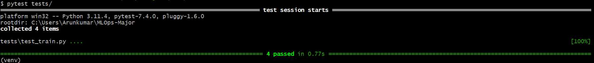
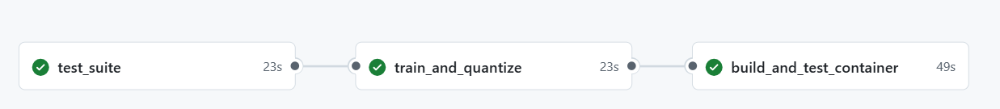

# MLOps Pipeline: California Housing Price Prediction

This project implements a complete **MLOps pipeline** for predicting California housing prices using Linear Regression and it has below features.

## Features:
- **End-to-End Pipeline**: Data loading → Training → Testing → Quantization → Containerization
- **Model**: Scikit-learn Linear Regression
- **Dataset**: California Housing (sklearn.datasets)
- **Optimization**: Manual 8-bit quantization
- **Containerization**: Docker support for model verification
- **Automation**: GitHub Actions Workflows

## Repo setup through command line:

### Root directory setup and GIT init:

    mkdir MLOps-Major
    cd MLOps-Major
    git init

### Basic files creation:

    touch README.md .gitignore requirements.txt

### Directory structure creations:
 
    mkdir -p .github/workflows src tests

Add code and necessary files as per below structure

## Project Structure:
        ```
        MLOps-Major/
        ├── .github/
        │   └── workflows/
        │       └── ci.yml
        ├── src/
        │   ├── __init__.py
        │   ├── train.py
        │   ├── quantize.py
        │   ├── predict.py
        │   └── utils.py
        ├── tests/
        │   ├── __init__.py
        │   └── test_train.py
        ├── Dockerfile
        ├── requirements.txt
        ├── .gitignore
        └── README.md
        ```
- **MLOps-Major/** : Root directory containing all project components.
- **.github/workflows/ci.yml** : GitHub Actions configuration for pipeline run (testing, training & quantization, Docker build & run).
- **src/__init__.py** : Marks the src directory as a Python package.
- **src/train.py** : Contains Linear Regression model training logic (data loading, training model, saving checkpoints).
- **src/quantize.py** : Converts trained Linear Regression weights to 8-bit integers (manual quantization) and verifies inference accuracy 
- **src/predict.py** : Handles model predictions (loads trained model, processes input, returns output).
- **src/utils.py** : Shared utilities (i.e helper functions)
- **tests/__init__.py** : Enables test directory to be treated as a Python package.
- **tests/test_train.py** : Unit tests for training logic (pytest).
- **Dockerfile** : Defines Docker image setup (Python 3.9, dependencies, packaging).
- **requirements.txt** : Lists of python dependencies.
- **.gitignore** :  Excludes files/folders from Git (e.g., __pycache__, .env, *.pth).
- **README.md** : Project documentation details

After adding code and files proceed with below steps,

### Create a virtual environment and install dependencies:

    python -m venv venv
    source venv/Scripts/activate
    pip install -r requirements.txt

### local code run and test commands:

    python -m src.train
    python -m src.quantize
    python -m src.predict
    pytest tests/
    docker build -t mlops-major .
    docker run --rm mlops-major

### Commit and push to GitHub:

    git add .
    git commit -m "Initial commit"
    git branch -M main
    git remote add origin https://github.com/maste21/MLOps-Major.git
    git push -u origin main


## Project Setup in local from git repo:

### Prerequisites:
- Python 3.9+ 
- Git
- Docker

### Clone the repo

    git clone https://github.com/maste21/MLOps-Major.git
    cd MLOps-Major

### Create virtual environment 

    python -m venv venv
    source venv/Scripts/activate

### Install dependencies

    pip install -r requirements.txt

### Training Model

    python -m src.train

    **Output:**
    ```
    Creating LinearRegression model...
    Loading California Housing dataset...
    Dataset split: Train=16512, Test=4128
    Training model...

    Model Evaluation:
    ========================================
    R² Score            : 0.575788
    Mean Squared Error  : 0.555892
    ========================================
    Model successfully saved to models/linear_regression.joblib

    Training completed. Model saved to models/linear_regression.joblib
    ```

### Quantization

    python -m src.quantize

    **Output:**
    ```
    Model successfully loaded from models/linear_regression.joblib
    Saved original parameters to models/unquant_params.joblib

    Quantization scale factor: 3.4303
    Quantized ranges:
      coef_: [-1, 3]
      intercept_: -127

    Quantization Errors:
    ========================================
    Max Coefficient Error    : 0.14218619
    Mean Coefficient Error   : 0.07910279
    Intercept Error          : 0.00000000

    Quantization artifacts saved:
    - models/unquant_params.joblib (original)
    - models/quant_params.joblib (quantized)
    - models/dequant_model.joblib (dequantized)
    ```    


## Quantization Performance

| Metric                | Value       |
|-----------------------|-------------|
| Max Coefficient Error | 0.142       |
| Intercept Error       | 0.0         |
| Scale Factor          | 3.4303      |


### Prediction

    python -m src.predict

    **Output:**
    ```
    Sample predictions:
    Sample 1:
      Features: [   8.3252       41.            6.98412698    1.02380952  322.
        2.55555556   37.88       -122.23      ]
      Prediction: 4.15

    Sample 2:
      Features: [ 8.30140000e+00  2.10000000e+01  6.23813708e+00  9.71880492e-01
        2.40100000e+03  2.10984183e+00  3.78600000e+01 -1.22220000e+02]
      Prediction: 4.00

    Sample 3:
      Features: [   7.2574       52.            8.28813559    1.07344633  496.
        2.80225989   37.85       -122.24      ]
      Prediction: 3.67

    Sample 4:
      Features: [   5.6431       52.            5.8173516     1.07305936  558.
        2.54794521   37.85       -122.25      ]
      Prediction: 3.26

    Sample 5:
      Features: [   3.8462       52.            6.28185328    1.08108108  565.
        2.18146718   37.85       -122.25      ]
      Prediction: 2.40
    ``` 

## Performance Comparison

| Metric                | Original Model | Quantized Model | Improvement |
|-----------------------|----------------|-----------------|-------------|
| **Accuracy**          |                |                 |             |
| R² Score              | 0.576          | 0.576           | ±0%         |
| MSE                   | 0.556          | 0.556           | ±0%         |
| Model Size            | 664 bytes      | 397 bytes       | **40%↓**    |
|------------------------------------------------------------------------|                      
|**Quantization Stats** |                |                 |             |
| Scale Factor          | N/A            | 3.4303          | -           |
| Weight Range (coef_)  | N/A            | [-1, 3]         | -           |
| Intercept Value       | N/A            | -127            | -           |
| **Quantization Error**|                |                 |             |
| Max Error             | N/A            | 0.142           | -           |
| Mean Error            | N/A            | 0.079           | -           |
| Intercept Error       | N/A            | 0.000           | -           |


### Testing

    pytest tests/




## Docker build and run:

### Build image

    docker build -t mlops-major .

### Run container
    
    docker run --rm mlops-major


## Pipeline Setup:

**Three Automated Stages:**

**1.Test**: Runs pytest validation (tests/test_train.py)
- Executes unit tests to validate code functionality

**2.Train & Quantize**: Trains model and optimizes parameters
- Performs model training with the latest data
- Applies quantization to reduce model size

**3.Build & Test**: Creates Docker image and runs verification tests
- Builds container with the trained model
- Runs prediction tests to verify model functionality       

**Key Features:**
- Runs on every `git push`
- Python 3.9 environment
- Artifacts passed between stages
- Container verification as final quality check

### Workflow Diagram




